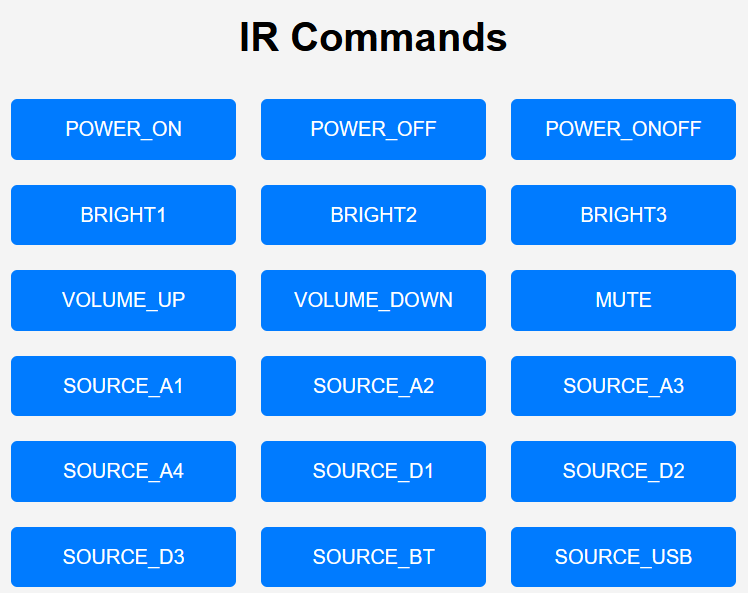

# CXA81-IR-Remote-Server

[](https://opensource.org/licenses/MIT)
<!-- ABOUT THE PROJECT -->
## About The Project

This project aims to enable users to control their Cambridge Audio CXA81 amplifier from anywhere within the range of their home Wi-Fi network, using an open-source server that replaces the need for an IR remote control. The inspiration for this project came from the fact that Canbridge Audio's StreamMagic app is not compatible with the CXA series, and the only way to control the CXA81 is by using a compatible CXN streamer, which not everyone may have.

While there are other methods to connect to the CXA81 besides IR, the IR connection is the quickest, easiest, and most robust connection, which includes volume control. The project is built on a Raspberry Pi Zero W and uses an IR transmitter to control the CXA81 amplifier.



### Built With

This project is built using the following hardware and software:

Hardware:
  * [Raspberry Pi Zero W](https://www.adafruit.com/product/3400)
  * [BalenaEtcher](https://www.balena.io/etcher/)
  * [Raspberry Pi OS Lite](https://www.raspberrypi.com/software/operating-systems/) Release date: October 30th 2021 Kernel version: 5.10
  * [Gikfun Digital 38khz Ir Receiver Ir Transmitter Sensor Module Kit (Set of 3 each - 6 total)](https://www.amazon.com/dp/B0816P2545?psc=1&ref=ppx_yo2_dt_b_product_details)
  * [Jumper Wires - Connected 6" (F/F, 20 pack)](https://www.sparkfun.com/products/12796)


Software:

  * [Go Language](https://go.dev/)
  * [Gin Framework](https://github.com/gin-gonic/gin)

<!-- GETTING STARTED -->
## Getting Started

To get started with this project, follow these steps:

1. Download and flash the Raspberry Pi OS Lite to a Micro-SD card.

2. Create a file called "ssh" to remote into the Raspberry Pi Zero W.

3. Set your Wi-Fi in the wpa_supplicant.conf file.

4. Boot the Raspberry Pi Zero W for the first time and remote into it using "SSH pi@(your pi IP Address)" on a Linux machine with the default password "raspberry".

5. Install Git, Golang, and LIRC on the Raspberry Pi Zero W.

6. Edit the /boot/config.txt file and change the line where it says '#dtoverlay=gpio-ir-tx,gpio_pin=18' to 'dtoverlay=gpio-ir-tx,gpio_pin=13'.

7. Place the `cambridge.lircd.conf` file located in the `LIRC-Remote` folder of this repository into the `/etc/lirc/lircd.conf.d/` folder.

8. Stop the lircd service, make your changes, then start the service again.

9. Reboot your Raspberry Pi Zero W.

10. Clone and compile the go code in this repository.

## Build and install

A makefile is available to build and deploy this app as a *systemd* service.

The makefile also configures the necessary permissions to run the service on privileged ports (eg. port 80), and installs the config files from `LIRC-Remote`.

```shell
make build
make install
```

## Usage

The CXA81-IR-Remote-Server generates an index page with the available commands for the remote configured in `config.yaml`.

Each command from the remote then gets mapped to an endpoint.

Triggering the remote commands can be done in two ways:

- Clicking the appropriate button on the index page

- Sending HTTP GET request to the endpoint (e.g curl `http://<server-ip>:<server-port>/<endpoint>`)

The available IR commands can be listed using:
`irsend LIST <remote_name> "" | cut -f2 -d' '`

Exaple endpoints:

* `/power_onoff` - Turns the power on or off
* `/power_on` - Turns the power on
* `/power_off` - Turns the power off
* etc.

## Troubleshooting

If you encounter any issues when setting up or using the CXA81-IR-Remote-Server, here are some things you can try:

* Check that the Raspberry Pi is properly connected to the amplifier and the IR transmitters/receivers.
* Verify that the correct pins are being used for the IR transmitters/receivers in the /boot/config.txt file.
* Make sure that the LIRC service is running on the Raspberry Pi.
* Check that the correct codes are being sent by the server by running the irsend SEND_ONCE command manually from the command line.

If all else fails, you can try asking for help on the project's GitHub page.

## Contributing

If you would like to contribute to the CXA81-IR-Remote-Server project, please follow these steps:

1. Fork the repository on GitHub.
2. Create a new branch for your changes.
3. Make your changes and test them thoroughly.
4. Submit a pull request with your changes.

<!-- Reference -->
### References

For a reference image of the pinout diagram, refer to the image located in the Resources folder of this repository. The image source is https://freesvg.org/raspberry-pi-gpio-diagram and is licensed under the Creative Commons License.

## License

The CXA81-IR-Remote-Server is distributed under the MIT License. See the LICENSE file for more information.
